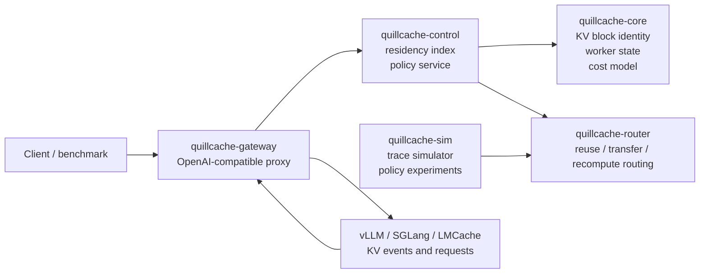

# QuillCache

QuillCache is a research and engineering platform for an **inference state
plane**: a system layer that treats LLM KV cache blocks as first-class,
routable, tiered state.

The project has moved on from the old Arrow/MLIR query compiler direction. The
active build surface is now focused on distributed KV cache research.

## Research Boundary

QuillCache studies the control-plane and storage-system problems around KV
cache reuse:

- content-addressed KV block identity across model, tokenizer, adapter, and
  tenant boundaries
- cache-aware routing for prefill/decode disaggregated serving
- reuse versus transfer versus recompute decisions under TTFT and TPOT SLOs
- tiered placement across GPU HBM, remote GPU memory, CPU DRAM, local SSD, and
  object storage
- agent/session-aware cache lifetime, pinning, prefetch, and eviction

The project does not implement an LLM kernel, an ANN index, or a full inference
engine. The intended integration targets are systems such as vLLM, SGLang,
LMCache, Mooncake, Dynamo/NIXL, llm-d, and KServe.

## Platform Architecture



## Packages

| Package | Role |
| ------- | ---- |
| `quillcache` | CLI for research plans and simulator runs. |
| `quillcache-control` | Residency index and policy-facing control-plane state. |
| `quillcache-core` | KV block keys, worker/cache residency state, SLO targets, and cost model. |
| `quillcache-gateway` | OpenAI-compatible proxy and KV event ingest service. |
| `quillcache-router` | Greedy baseline router that selects reuse, transfer, or recompute per block. |
| `quillcache-sim` | Synthetic trace generator and simulator for first routing experiments. |

## Quick Start

```bash
cargo run -- simulate
cargo run -- simulate --requests 64 --workers 4 --shared-prefix-blocks 12
cargo run -- simulate --json
cargo run -- plan
cargo run -- gateway --config examples/quillcache-gateway.yaml

cargo test --workspace
```

The current MVP includes a gateway and HTTP event ingest path. See
[`docs/positioning.md`](docs/positioning.md),
[`docs/platform-plan.md`](docs/platform-plan.md),
[`docs/architecture.md`](docs/architecture.md),
[`docs/index-backends.md`](docs/index-backends.md), and
[`docs/mvp-runbook.md`](docs/mvp-runbook.md) for the platform definition,
architecture, index-backend plan, and vLLM runbook.

## v0.1 Artifacts

- OpenAI-compatible gateway for `/v1/chat/completions` and `/v1/completions`.
- Vendor-neutral `/v1/kv-events` ingest API.
- `/v1/state` debug endpoint with engines, workers, index stats, and residency.
- vLLM ZMQ/msgpack KV event bridge.
- Greedy cache-aware router with local-hit, transfer, and recompute accounting.
- Pluggable `ResidencyIndexStore` boundary with an in-memory v0.1 backend.

## Research Milestones

1. Build a trace simulator for chat, RAG, and agentic workloads.
2. Define a KV block object model with explicit model/tokenizer/adapter/tenant
   identity.
3. Compare round-robin, cache-aware, SLO-aware, and network-aware routing.
4. Add tiered placement and eviction policies for HBM, DRAM, SSD, and remote
   pools.
5. Integrate with vLLM or SGLang through KV events and existing transfer/offload
   connector surfaces.
6. Add Holt and RocksDB residency-index backends for ART-vs-LSM measurement.
7. Evaluate against local prefix caching, LMCache-style external cache, and
   Mooncake-style distributed KV pool baselines.

## Current Non-Goals

- no custom transformer kernels
- no model weight serving
- no vector database
- no SQL frontend
- no production multi-tenant isolation guarantee yet
