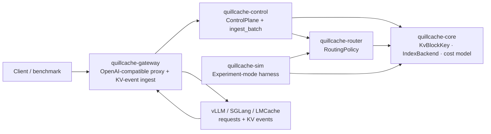

# QuillCache

[](https://github.com/feichai0017/quillcache/actions/workflows/ci.yml)
[](LICENSE)

> **QuillCache is a research platform and control-plane prototype for
> identity-aware, persistent, and policy-driven KV cache reuse in LLM serving.**

QuillCache is a **vendor-neutral KV cache control plane and evaluation platform**
for LLM inference. It does not run models and it does not move KV tensors. It
sits in front of / beside real engines (vLLM, SGLang) and the KV data plane
(LMCache, NVIDIA Dynamo KVBM) and owns the *metadata and the decisions*: block
identity, residency, routing, and reuse / transfer / recompute / evict policy.

It is built as a **research instrument**: engines, routing policies, and index
backends are all pluggable, so you can replay one workload across many
combinations and measure them apples-to-apples.

## What it is / is not

| It IS | It is NOT |
| --- | --- |
| a gateway in front of real engines | a new vLLM / SGLang (no kernels, no model execution) |
| a residency index fed by real KV events | a new LMCache (not a KV **tensor** data plane) |
| a policy engine (route / reuse / recompute / pin / evict) | a new Dynamo KVBM (not a distributed block memory manager) |
| a research instrument comparing policies **and** index backends | a paper-only simulator (it connects to real engines) |
| the experiment substrate for Holt / RocksDB / Memory / FS indexes | a store for large KV **tensors** |

## Layering

```text
vLLM / SGLang     = inference engines (run the model, own live KV tensors)
LMCache / KVBM    = KV tensor data plane / offload backend
QuillCache        = control plane + research platform   <-- this repo
Holt              = persistent ART index backend
RocksDB           = LSM index baseline
```

QuillCache holds **identity + residency metadata** and makes **decisions**. The
KV tensor bytes live in the data plane. The two planes meet at the *index* and
the *storage tier*, never as the same object.

## Architecture



## Three pluggable axes

Experiment mode replays the same trace across the product of these axes; Online
mode runs one chosen combination in front of real engines.

| Axis | Trait / type | Available | Planned |
| --- | --- | --- | --- |
| Inference engine / connector | `EngineEndpoint` + KV events | vLLM (OpenAI-compatible + KV events) | SGLang, LMCache events |
| Routing policy | `quillcache_core` → `quillcache_router::RoutingPolicy` | `LeastLoadedRouter` (baseline), `GreedyStatePlaneRouter` (cache-aware) | SLO-aware, session/DAG-aware |
| Index backend | `quillcache_core::IndexBackend` | `MemoryIndex` (reference), **Holt** (ART), **RocksDB** (LSM) | filesystem |

## Two "KV"s, two "backends" (read this first)

| | Stores | Size | Owner |
| --- | --- | --- | --- |
| **Index backend** (Holt / RocksDB / Memory / FS) | residency **metadata**: which block (by identity) lives on which worker/tier | small records | **QuillCache** |
| **Data plane backend** (LMCache / KVBM) | the actual KV **tensor** bytes | large | engine / data plane |

The ART-vs-LSM line below is about the **index backend**, not the data plane.
Holt stores the *catalog/index*, not the KV tensors.

## Why ART (Holt) vs RocksDB (LSM)

The residency / prefix index is written on every KV event and read on every
request (longest reusable prefix). Its workload is **prefix-heavy** (shared
system prompts, RAG docs, agent session DAGs) and **write-frequent**, and a
persistent control plane needs it on disk. Two natural designs:

- **ART (Holt)** — radix/trie, **prefix-native**, near-memory point/prefix
  lookups, **no compaction write amplification** (SGLang's RadixAttention uses a
  radix tree in memory for exactly this).
- **LSM (RocksDB)** — write-optimized via compaction, but compaction causes
  write amplification and prefix scans are less natural.

So the route is a **controlled experiment** behind one `IndexBackend` trait:
*which storage engine is the right substrate for a KV-cache residency/prefix
index?* Measured on the same trace: write amplification, prefix-scan latency,
point-lookup p50/p99, ingest throughput, restart recovery time, on-disk size. A
recently published RocksDB/LSM approach left write amplification unanalyzed —
that gap is the first measurable result.

### First results

Same workload (2000 requests, 8016 resident blocks, 20k `prefix_scan` queries),
same `IndexBackend` trait, via `quillcache bench-index`:

| backend | ingest (puts/s) | prefix_scan p50 | prefix_scan p99 | recovery | on-disk |
| --- | --- | --- | --- | --- | --- |
| memory (flat map) | 706k | 494 µs | 1685 µs | — | 0 |
| rocksdb (LSM) | 56k | 16.8 µs | 29.6 µs | 4.1 ms | 500 KB |
| **holt (ART)** | 55k | **9.96 µs** | **13.7 µs** | **2.6 ms** | 8.4 MB |

For the prefix-heavy residency workload, **ART (Holt) gives the lowest
prefix-scan latency** (~1.7× faster than LSM at p50, ~2.2× at p99; ~50× faster
than the flat in-memory map's O(N) scan) and the fastest recovery. **LSM
(RocksDB) is far more space-efficient on disk** (compression + compaction).
Ingest is comparable between the two persistent backends and ~13× slower than
in-memory — the cost of durability. So pick ART when prefix-scan latency and
recovery dominate (the common case for a residency index queried per request),
pick LSM when on-disk footprint is the constraint. Numbers are from one machine;
reproduce with `cargo run --features "rocksdb holt" -- bench-index --backend <b>`.

## Packages

| Package | Role |
| --- | --- |
| `quillcache` | CLI: `simulate`, `plan`, `gateway`. |
| `quillcache-core` | `KvBlockKey` identity, `CacheResidency`, cost model, and the `IndexBackend` trait + `MemoryIndex` reference backend. |
| `quillcache-router` | `RoutingPolicy` trait; `GreedyStatePlaneRouter` (cache-aware) and `LeastLoadedRouter` (baseline). |
| `quillcache-control` | `ControlPlane` and the backend-agnostic `ingest_batch` (KV events → residency). |
| `quillcache-gateway` | OpenAI-compatible proxy + `/v1/kv-events` ingest + `/v1/state`. |
| `quillcache-sim` | Experiment-mode harness: replay a trace over any policy × any backend. |
| `quillcache-index-rocksdb` | RocksDB (LSM) `IndexBackend` (optional `rocksdb` feature; needs a C++ toolchain). |
| `quillcache-index-holt` | Holt (persistent ART) `IndexBackend` (optional `holt` feature; pure Rust). |

## Quick start

```bash
# Experiment mode: synthetic shared-prefix workload through the cache-aware
# router over the in-memory index backend.
cargo run -- simulate
cargo run -- simulate --requests 64 --workers 4 --shared-prefix-blocks 12
cargo run -- simulate --json

# Compare index storage engines (memory vs LSM vs ART) on one trace.
cargo run --features "rocksdb holt" -- bench-index --backend memory
cargo run --features "rocksdb holt" -- bench-index --backend rocksdb
cargo run --features "rocksdb holt" -- bench-index --backend holt

# Print the research plan / build order.
cargo run -- plan

# Online mode: OpenAI-compatible gateway in front of real vLLM/SGLang workers.
cargo run -- gateway --config examples/quillcache-gateway.yaml

# Tests
cargo test --workspace
```

Online-mode endpoints: `POST /v1/chat/completions`, `POST /v1/completions`,
`POST /v1/kv-events`, `GET /v1/state`, `GET /healthz`. The gateway strips the
optional `quillcache` request object before forwarding, so benchmarks can supply
exact block hashes while keeping the upstream request clean. See
[`docs/mvp-runbook.md`](docs/mvp-runbook.md) for the vLLM KV-events bridge.

## Documentation

- [`docs/positioning.md`](docs/positioning.md) — north-star scope (what it is / is not).
- [`docs/architecture.md`](docs/architecture.md) — components, boundaries, the index seam.
- [`docs/index-backends.md`](docs/index-backends.md) — `IndexBackend`, Holt/RocksDB plan, ART-vs-LSM measurement.
- [`docs/platform-plan.md`](docs/platform-plan.md) — platform goals, MVP scope, build order.
- [`docs/research-agenda.md`](docs/research-agenda.md) — claim budget and research bets.
- [`docs/experiments.md`](docs/experiments.md) — experiment harness and baselines.
- [`docs/mvp-runbook.md`](docs/mvp-runbook.md) — run the gateway against real vLLM.

## Status (v0.1)

- ✅ OpenAI-compatible gateway with cache-aware routing and decision headers.
- ✅ Vendor-neutral `/v1/kv-events` ingest (vLLM BlockStored / BlockRemoved / AllBlocksCleared shape).
- ✅ Single `IndexBackend` seam with an in-memory reference backend + identity-aware prefix scan.
- ✅ Pluggable `RoutingPolicy` with a load-only baseline and a cache-aware policy.
- ✅ Experiment harness comparing policies × backends on one trace.
- ✅ Holt (ART) and RocksDB (LSM) index backends + `bench-index` ART-vs-LSM comparison.
- ⏳ vLLM ZMQ/msgpack KV-event bridge wired end-to-end; SGLang connector.

## Roadmap

1. ✅ Holt (ART) + RocksDB (LSM) `IndexBackend`s + ART-vs-LSM benchmark — done; next: deepen it (true write-amplification, Holt compaction/on-disk, larger traces).
2. SLO-aware and session/DAG-aware routing policies.
3. Real vLLM/SGLang KV-event connectors end-to-end; chat / RAG / agent traces.
4. Tiered placement and eviction across HBM / DRAM / SSD / remote.
5. Identity-governed safe reuse: refuse unsafe reuse and quantify its cost.
6. Baselines: engine-local prefix caching, LMCache-style cache, Mooncake-style pool.

## Non-goals

- no transformer kernels, no model weight serving
- no KV tensor movement in the control plane (that is the data plane's job)
- no vector database, no SQL frontend
- no production multi-tenant isolation guarantee yet

## License

MIT — see [LICENSE](LICENSE).
