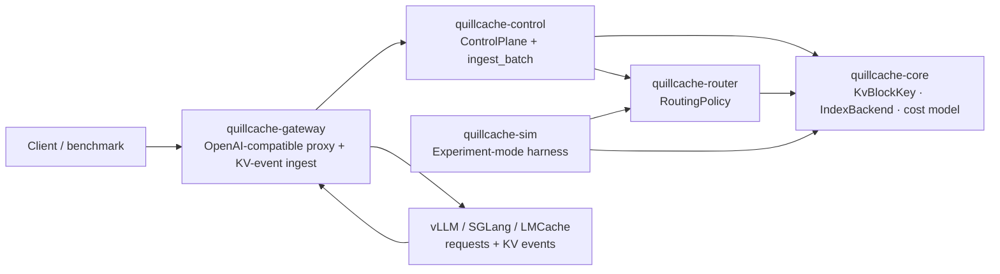

# QuillCache

[](https://github.com/feichai0017/quillcache/actions/workflows/ci.yml)
[](LICENSE)
[](https://feichai0017.github.io/quillcache/)
[](https://crates.io/crates/quillcache)

> **QuillCache is a research platform and control-plane prototype for
> identity-aware, persistent, and policy-driven KV cache reuse in LLM serving.**

**▶ Overview & results: [feichai0017.github.io/quillcache](https://feichai0017.github.io/quillcache/)**

QuillCache is a **vendor-neutral KV cache control plane and evaluation platform**
for LLM inference. It does not run models and it does not move KV tensors. It
sits in front of / beside real engines (vLLM, SGLang) and the KV data plane
(LMCache, NVIDIA Dynamo KVBM, Tencent FlexKV) and owns the *metadata and the
decisions*: block identity, residency, routing, and reuse / transfer / recompute
/ evict policy. Those data planes move and store KV tensors; QuillCache is the
neutral layer **above** them — it can drive and compare them, and it enforces the
one thing they leave implicit: **identity-governed safe reuse** (below).

It is built as a **research instrument**: engines, routing policies, and index
backends are all pluggable, so you can replay one workload across many
combinations and measure them apples-to-apples.

## What it is / is not

| It IS | It is NOT |
| --- | --- |
| a gateway in front of real engines | a new vLLM / SGLang (no kernels, no model execution) |
| a residency index fed by real KV events | a new LMCache / FlexKV (not a KV **tensor** data plane) |
| a policy engine (route / reuse / recompute / pin / evict) | a new Dynamo KVBM (not a distributed block memory manager) |
| a research instrument comparing policies **and** index backends | a paper-only simulator (it connects to real engines) |
| the experiment substrate for Holt / RocksDB / Memory / FS indexes | a store for large KV **tensors** |

## Layering

```text
vLLM / SGLang        = inference engines (run the model, own live KV tensors)
LMCache/KVBM/FlexKV  = KV tensor data plane / offload backend
QuillCache           = control plane + research platform   <-- this repo
Holt                 = persistent ART index backend
RocksDB              = LSM index baseline
```

QuillCache holds **identity + residency metadata** and makes **decisions**. The
KV tensor bytes live in the data plane. The two planes meet at the *index* and
the *storage tier*, never as the same object.

## Architecture



## Three pluggable axes

Experiment mode replays the same trace across the product of these axes; Online
mode runs one chosen combination in front of real engines.

| Axis | Trait / type | Available | Planned |
| --- | --- | --- | --- |
| Inference engine / connector | `EngineEndpoint` + KV events | vLLM (OpenAI-compatible + KV events) | SGLang, LMCache events |
| Routing policy | `quillcache_core` → `quillcache_router::RoutingPolicy` | `LeastLoadedRouter` (baseline), `GreedyStatePlaneRouter` (cache-aware), `PrefixAffinityRouter`, `RoundRobinRouter`, **`SloAwareRouter`** (SLO as a near-hard constraint), **`SessionAffinityRouter`** (pin a session/DAG to its engine) | network-aware |
| Index backend | `quillcache_core::IndexBackend` | `MemoryIndex` (reference), **Holt** (ART), **RocksDB** (LSM) | filesystem |

## Two "KV"s, two "backends" (read this first)

| | Stores | Size | Owner |
| --- | --- | --- | --- |
| **Index backend** (Holt / RocksDB / Memory / FS) | residency **metadata**: which block (by identity) lives on which worker/tier | small records | **QuillCache** |
| **Data plane backend** (LMCache / KVBM) | the actual KV **tensor** bytes | large | engine / data plane |

The ART-vs-LSM line below is about the **index backend**, not the data plane.
Holt stores the *catalog/index*, not the KV tensors.

## Identity-governed safe reuse (the spike)

A KV block's **content hash** is computed from its tokens, so the same tokens
produce the same hash — *regardless of which tenant sent them, which LoRA adapter
is active, or which model/tokenizer version is loaded*. But the KV **tensors**
depend on all of those. So a cache that reuses on content hash alone — which is
what data-plane caches (FlexKV / LMCache / KVBM) key on — will serve blocks it
must not:

- across **tenants** → a **privacy leak** (one tenant's cached state served to another),
- across **adapters / models / tokenizers** → a **correctness error** (numerically wrong KV).

QuillCache makes the reuse contract explicit: every block carries an
`IdentityScope` (model · tokenizer · adapter · tenant), and reuse is allowed only
when it matches (`quillcache_core::ReuseViolation` classifies why it doesn't).
The `safe-reuse` experiment quantifies the gap on a collision-heavy workload —
one popular prefix shared across many identities, i.e. the multi-tenant
shared-system-prompt / shared-RAG-doc case:

```
quillcache safe-reuse           # 12 identities share each prefix
```

| policy | content-hash hits | unsafe served | of which | safe reuse kept |
| --- | --- | --- | --- | --- |
| naive (content hash only) | 12400 | **12000 (96.8%)** | 5600 cross-tenant (privacy) + 3200 cross-adapter + 1600 cross-model/quant + 1600 cross-tokenizer (correctness) | — |
| **QuillCache (identity guard)** | — | **0** | — | 4800 |

All four identity axes — tenant, adapter, model/quantization, tokenizer version —
are exercised (`--tenants --adapters --models --tokenizers`); each variant shares
token content but not KV tensors.

The guard eliminates **all** unsafe reuse while preserving safe same-identity
reuse, at a measured cost (here ~12.7 s of prefill recompute to avoid 8800 unsafe
serves). Push it to a privacy-heavy mix (`--tenants 32 --adapters 0`) and **98.4%**
of the naive cache's hits are cross-tenant leaks.

**Safety is near-free in practice.** The 95.7% figure is an adversarial workload
(every identity collides). On a realistic mix where most reuse is same-identity
(`--tenants 2 --adapters 1 --repeats 40`), the guard's overhead — forced
recomputes as a fraction of all reuse work — drops to **1.7%**, while it still
refuses 32000 unsafe serves. The safety constraint costs ~0 exactly where it
matters.

**Enforced inline, not just in the experiment.** The same check runs on the live
gateway: `ControlPlane::audit_reuse` flags any request block whose content is
resident only under another identity, and the response carries
`x-quillcache-reuse-refused: N`. Verified live — after a `tenant-a` request
caches a prefix, a `tenant-b` request for the *same content* returns
`x-quillcache-local-hits: 0` and `x-quillcache-reuse-refused: 2`: QuillCache
refuses to serve tenant A's KV to tenant B and says so. This is the contract the
production data planes leave implicit; here it is explicit, enforced, and
measurable.

## Why ART (Holt) vs RocksDB (LSM)

The residency / prefix index is written on every KV event and read on every
request (longest reusable prefix). Its workload is **prefix-heavy** (shared
system prompts, RAG docs, agent session DAGs) and **write-frequent**, and a
persistent control plane needs it on disk. Two natural designs:

- **ART (Holt)** — radix/trie, **prefix-native**, near-memory point/prefix
  lookups, **no compaction write amplification** (SGLang's RadixAttention uses a
  radix tree in memory for exactly this).
- **LSM (RocksDB)** — write-optimized via compaction, but compaction causes
  write amplification and prefix scans are less natural.

So the route is a **controlled experiment** behind one `IndexBackend` trait:
*which storage engine is the right substrate for a KV-cache residency/prefix
index?* Measured on the same trace: write amplification, prefix-scan latency,
point-lookup p50/p99, ingest throughput, restart recovery time, on-disk size. A
recently published RocksDB/LSM approach left write amplification unanalyzed —
that gap is the first measurable result.

### First results

Same workload (2000 requests, 8016 resident blocks, 20k `prefix_scan` queries),
same `IndexBackend` trait, via `quillcache bench-index`:

| backend | ingest (puts/s) | prefix_scan p50 | prefix_scan p99 | recovery | on-disk |
| --- | --- | --- | --- | --- | --- |
| memory (flat map) | 706k | 494 µs | 1685 µs | — | 0 |
| rocksdb (LSM) | 56k | 16.8 µs | 29.6 µs | 4.1 ms | 500 KB |
| **holt (ART)** | 55k | **9.96 µs** | **13.7 µs** | **2.6 ms** | 8.4 MB |

For the prefix-heavy residency workload, **ART (Holt) gives the lowest
prefix-scan latency** (~1.7× faster than LSM at p50, ~2.2× at p99; ~50× faster
than the flat in-memory map's O(N) scan) and the fastest recovery. **LSM
(RocksDB) is far more space-efficient on disk** (compression + compaction).
Ingest is comparable between the two persistent backends and ~13× slower than
in-memory — the cost of durability. So pick ART when prefix-scan latency and
recovery dominate (the common case for a residency index queried per request),
pick LSM when on-disk footprint is the constraint. Numbers are from one machine;
reproduce with `cargo run --features "rocksdb holt" -- bench-index --backend <b>`.

### Eviction churn (and a bottleneck the benchmark caught)

A residency index under HBM pressure does not just ingest and scan — it
*evicts*. Adding a churn phase (`--churn-ops`: `remove_block` + `put` per cycle)
surfaced that `remove_block` was **O(scope)**: given a block hash but not its
prefix, every backend scanned and deserialized the whole identity scope to find
one block. Eviction collapsed to ~1.4k ops/s on the persistent backends. The fix
is a secondary `block_hash → primary key` index so eviction is an O(matches)
seek. Same workload (1000 requests, 2008 resident, 10k scans, **500 churn
cycles**), before vs after:

| backend | churn ops/s before | churn ops/s after | speedup | on-disk after |
| --- | --- | --- | --- | --- |
| memory (flat map) | 69k | **1.15M** | ~17× | 0 |
| rocksdb (LSM) | 1.4k | **154k** | ~106× | 175 KB |
| **holt (ART)** | 1.4k | **403k** | **~295×** | 8.4 MB |

The reverse index trades **~2× ingest throughput and a second key per residency
on disk** for **two-to-three-orders-of-magnitude faster eviction** — the right
trade for a control plane that evicts continuously. prefix-scan latency is
unchanged. This is the benchmark working as intended: it is a research
instrument, not a victory-lap table — it found the bottleneck, then measured the
fix.

## Packages

| Package | Role |
| --- | --- |
| `quillcache` | CLI: `simulate`, `bench-index`, `safe-reuse`, `tiered`, `disagg`, `plan`, `gateway`. |
| `quillcache-core` | `KvBlockKey` identity, `CacheResidency`, cost model, and the `IndexBackend` trait + `MemoryIndex` reference backend. |
| `quillcache-router` | `RoutingPolicy` trait; `GreedyStatePlaneRouter` (cache-aware) and `LeastLoadedRouter` (baseline). |
| `quillcache-control` | `ControlPlane` and the backend-agnostic `ingest_batch` (KV events → residency). |
| `quillcache-gateway` | OpenAI-compatible proxy + `/v1/kv-events` ingest + `/v1/state`. |
| `quillcache-sim` | Experiment-mode harness: replay a trace over any policy × any backend; `bench-index` and `safe-reuse` experiments. |
| `quillcache-index-rocksdb` | RocksDB (LSM) `IndexBackend` (optional `rocksdb` feature; needs a C++ toolchain). |
| `quillcache-index-holt` | Holt (persistent ART) `IndexBackend` (optional `holt` feature; pure Rust). |

## Quick start

```bash
# Experiment mode: synthetic shared-prefix workload through the cache-aware
# router over the in-memory index backend.
cargo run -- simulate
cargo run -- simulate --requests 64 --workers 4 --shared-prefix-blocks 12
cargo run -- simulate --json

# Compare index storage engines (memory vs LSM vs ART) on one trace.
cargo run --features "rocksdb holt" -- bench-index --backend memory
cargo run --features "rocksdb holt" -- bench-index --backend rocksdb
cargo run --features "rocksdb holt" -- bench-index --backend holt

# Identity-governed safe reuse: naive content-hash reuse vs the identity guard.
cargo run -- safe-reuse
cargo run -- safe-reuse --tenants 32 --adapters 0   # privacy-heavy mix

# Tiered KV block management (KVBM-style HBM/DRAM/SSD) vs an HBM-only baseline.
cargo run -- tiered
# Prefill/decode disaggregation (Dynamo/llm-d topology): TTFT under load.
cargo run -- disagg --load-percent 90

# Print the research plan / build order.
cargo run -- plan

# Online mode: OpenAI-compatible gateway in front of real vLLM/SGLang workers.
cargo run -- gateway --config examples/quillcache-gateway.yaml
# ...backed by a persistent ART (Holt) residency index that survives restarts:
cargo run --features holt -- gateway --config examples/quillcache-gateway.yaml  # set index: holt

# Tests
cargo test --workspace
```

Online-mode endpoints: `POST /v1/chat/completions`, `POST /v1/completions`,
`POST /v1/kv-events`, `GET /v1/state`, `GET /healthz`. The gateway strips the
optional `quillcache` request object before forwarding, so benchmarks can supply
exact block hashes while keeping the upstream request clean. See
[`docs/mvp-runbook.md`](docs/mvp-runbook.md) for the vLLM KV-events bridge.

## Documentation

- [`docs/positioning.md`](docs/positioning.md) — north-star scope (what it is / is not).
- [`docs/architecture.md`](docs/architecture.md) — components, boundaries, the index seam.
- [`docs/index-backends.md`](docs/index-backends.md) — `IndexBackend`, Holt/RocksDB plan, ART-vs-LSM measurement.
- [`docs/platform-plan.md`](docs/platform-plan.md) — platform goals, MVP scope, build order.
- [`docs/research-agenda.md`](docs/research-agenda.md) — claim budget and research bets.
- [`docs/experiments.md`](docs/experiments.md) — experiment harness and baselines.
- [`docs/mvp-runbook.md`](docs/mvp-runbook.md) — run the gateway against real vLLM.
- [`docs/m3-real-vllm.md`](docs/m3-real-vllm.md) — connect to a real vLLM on a cloud GPU (Modal deploy, KV-events bridge, trace runner).

## Status (v0.1)

- ✅ OpenAI-compatible gateway with cache-aware routing and decision headers.
- ✅ **Closed online residency loop**: the gateway records inferred placement from its own routing decisions and derives prefix blocks from the prompt, so cache-aware routing works end-to-end without a KV-events bridge (verified live: a 2nd request sharing a system prompt routes to the same engine with a real local hit). KV events (Tier 2) upgrade inferred residency to ground truth.
- ✅ Vendor-neutral `/v1/kv-events` ingest (vLLM BlockStored / BlockRemoved / AllBlocksCleared shape).
- ✅ Single `IndexBackend` seam with an in-memory reference backend + identity-aware prefix scan.
- ✅ **Persistent residency index in the online gateway** (`index: holt` / `rocksdb`): the control plane can be backed by Holt (persistent ART), so fleet residency **survives a gateway restart** — verified live (2 blocks placed → SIGTERM flush → reopen → 2 blocks recovered, no replay of events).
- ✅ Mixed **engine fleet** behind one control plane (vLLM + SGLang, both OpenAI-compatible — see `examples/quillcache-mixed-fleet.yaml`) and a **`DataPlane` seam** where a KV-tensor store (LMCache / Dynamo KVBM / FlexKV) plugs in under the control plane (`NoDataPlane` default, `MockDataPlane` for tests).
- ✅ **Tiered KV block management** (`quillcache tiered`) — a KVBM-style HBM→DRAM→SSD cache with promotion / demotion / eviction vs an HBM-only baseline. On a skewed trace it turns ~13k recomputes into cheap tier-hits and cuts total prefill cost **~76%** (HBM 59% / DRAM 22% / SSD 10% hits, 9% miss).
- ✅ **Prefill/decode disaggregation** (`quillcache disagg`) — a discrete-event TTFT sim of the Dynamo/llm-d topology (aggregated prefill+decode per engine vs a prefill pool + decode pool, Poisson arrivals). Disaggregation cuts p99 TTFT **24% @ 75% load, 41% @ 90%** (prefill no longer queues behind long decodes); the gain grows with load.
- ✅ Pluggable `RoutingPolicy`: load-only baseline, cache-aware greedy, prefix-affinity, round-robin, SLO-aware (SLO as a near-hard constraint), and session-affine (pin a multi-turn/agent session to the engine accumulating its KV).
- ✅ Experiment harness comparing policies × backends on one trace.
- ✅ Holt (ART) and RocksDB (LSM) index backends + `bench-index` ART-vs-LSM comparison.
- ✅ Eviction-churn benchmark + O(matches) `remove_block` via a secondary block_hash index (100–300× faster eviction on the persistent backends).
- ✅ Identity-governed safe reuse: `ReuseViolation` classifier + `safe-reuse` experiment, and the same guard enforced inline on the gateway (`x-quillcache-reuse-refused`). Safety overhead ~1.7% on a realistic workload.
- ✅ Real vLLM connected end-to-end (M3): proxied a real Qwen2.5 on a Modal L4 with real TTFT and decision headers. Cache-affine fleet routing across 2 vLLM instances (P99 TTFT 81 s → 4.3 s).
- ✅ Tier-2 inferred→precise correction: a KV `BlockRemoved` event corrects stale inferred residency (verified live — a re-request's local hits drop from 2→1 after an eviction event). `deploy/modal_vllm.py` is Tier-2-ready (`QC_KV_EVENTS=1` enables `--kv-events-config` + a co-located bridge sidecar). SGLang connector later.

## Roadmap

1. ✅ Holt (ART) + RocksDB (LSM) `IndexBackend`s + ART-vs-LSM benchmark + eviction churn (O(matches) `remove_block`) — done; next: true write-amplification, Holt compaction/on-disk, larger traces.
2. ✅ SLO-aware routing (`SloAwareRouter`) and session/DAG-affine routing (`SessionAffinityRouter`: pin a session to the engine accumulating its KV) — done; next: network-aware placement.
3. ✅ Real vLLM KV-event connector end-to-end (inferred placement + Tier-2 `/v1/kv-events` correction) — done; next: SGLang connector, chat / RAG / agent traces.
4. ✅ Tiered placement and eviction across HBM / DRAM / SSD (`tiered`, KVBM-style) — done; next: remote tier, tier-aware routing in the online path.
5. ✅ Identity-governed safe reuse: refuse unsafe reuse and quantify its cost (`safe-reuse`) — done; next: enforce it inline in the gateway and add cross-model/tokenizer/quant axes.
6. Baselines: engine-local prefix caching, LMCache-style cache, Mooncake-style pool.

## Non-goals

- no transformer kernels, no model weight serving
- no KV tensor movement in the control plane (that is the data plane's job)
- no vector database, no SQL frontend
- no production multi-tenant isolation guarantee yet

## License

MIT — see [LICENSE](LICENSE).
