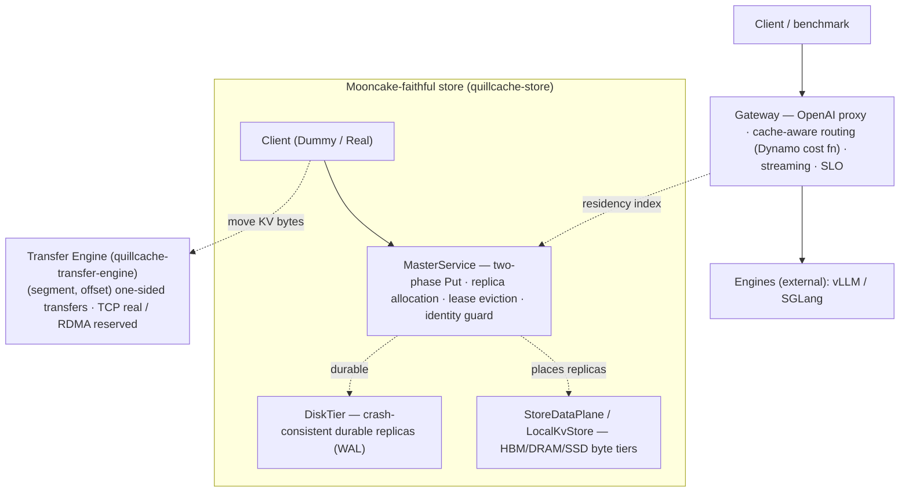

# QuillCache

[](https://github.com/feichai0017/quillcache/actions/workflows/ci.yml)
[](LICENSE)
[](https://feichai0017.github.io/quillcache/)
[](https://crates.io/crates/quillcache)

> **QuillCache is a faithful Rust port of [Mooncake](https://github.com/kvcache-ai/Mooncake)'s
> distributed KV cache store** (the KVCache-centric data plane from Moonshot / Kimi,
> FAST'25) — its component decomposition, code layout, and API mirrored module for
> module — **plus two properties the production data planes leave implicit:
> identity-governed safe reuse and a crash-consistent persistent tier.** A
> cache-aware routing gateway (the Dynamo KV-router cost function) sits in front.

QuillCache sits beside real inference engines (vLLM, SGLang) and owns the KV
cache as a resource. It does **not** run models — no transformer kernels, no
attention.

- a **Transfer Engine** (`quillcache-transfer-engine`) — moves bytes one-sidedly
  between *registered memory* by `(segment, offset)`, exactly like Mooncake (TCP
  today; RDMA / GPUDirect reserved behind the same trait);
- a **Store** (`quillcache-store`) — a two-phase-Put `Client`, a `MasterService`
  (object metadata, replica allocation, lease eviction), a buffer allocator, the
  replica model, and a crash-consistent durable `DiskTier`;
- a **Gateway / Conductor** — an OpenAI-compatible proxy that routes cache-aware
  (the Dynamo KV-router cost function), governs reuse, and meters SLO, backed by a
  persistent residency index.

The active design line is a **KV-cache-centric co-scheduler**: a cluster-level
controller that jointly tunes prefill/decode capacity, HBM cache split, hot-prefix
replication, tier placement, and transfer depth to maximize SLO goodput. See
[`docs/co-scheduler-design.md`](docs/co-scheduler-design.md).

## Architecture



## Reference-design mapping

QuillCache mirrors Mooncake's decomposition piece by piece, then adds its
differentiation on top:

| Mooncake / Dynamo | QuillCache | Status |
| --- | --- | --- |
| Transfer Engine (`TransferEngine` + `Transport`; host **& GPU HBM** segments) | `quillcache-transfer-engine` (`engine` · `transport::{tcp,rdma,nvlink}` · `device_segment`) | ✅ TCP · ✅ **GPU HBM segment** (L4) / ⊙ RDMA · NVLink reserved |
| Store `Client` (`PutStart`/`PutEnd`/`Get`) | `DummyClient` / `RealClient` | ✅ end-to-end over the transfer engine |
| Store `MasterService` (two-phase Put, eviction, **HA**) | `MasterService` + snapshot/recovery + heartbeat health + `MasterElection` | ✅ alloc · lease evict · **crash-safe snapshot + failover** · etcd leader-election (verified) |
| `BufferAllocator` + `AllocationStrategy` | `OffsetBufferAllocator` + `Random`/`FreeRatioFirst` | ✅ |
| `TransferMetadata` (etcd/redis/http/p2p) | `MetadataBackend`: `InMemoryMetadata` / `EtcdMetadata` (feature `etcd`) | ✅ in-memory · ✅ etcd (verified vs real etcd) |
| Dynamo KV-router cost function | `DynamoCostRouter` | ✅ reproduces the worked example |
| Dynamo KVBM tiers (G1 HBM / G2 host / G3 disk) | `StoreDataPlane` (DRAM/SSD) + `quillcache-cuda` (HBM G1 + FP8 quantize) | ✅ DRAM/SSD · ✅ **HBM H2D/D2H** (L4) · FP8 quantize (GPU+NVRTC) |
| Mooncake GPU data path (device segment · GPUDirect-RDMA · NVLink · GDS) | `device_segment` (HBM, cudaMemcpy) · `rdma`/`nvlink` (zero-copy) | ✅ **HBM segment** (L4) · ⊙ GPUDirect/NVLink need a NIC/multi-GPU |
| Mooncake Conductor / Dynamo KV-Cache Indexer | `conductor` (`PrefixCacheTable` + `ModelContext` + `KVEventHandler`) + residency index (Holt ART) | ✅ longest-prefix overlap · persistent |
| — *(neither does this)* | **identity guard + crash-consistent `DiskTier`** | 🎯 differentiation |

## Crates

| crate | role |
| --- | --- |
| `quillcache` (bin) | the OpenAI-compatible **gateway** (proxy · cache-aware routing · streaming · SLO), the local **cluster** demo, and `bench-index` |
| `quillcache-core` | `KvBlockKey` / `IdentityScope` identity, `CostModel`, `ReuseViolation`; the `router` (incl. `DynamoCostRouter`), `control` plane, `DataPlane` + `IndexBackend` traits, the ART-vs-LSM `bench`, and the feature-gated `index_holt` / `index_rocksdb` backends |
| `quillcache-transfer-engine` | faithful port of Mooncake's Transfer Engine: `TransferEngine` + `MultiTransport` + `Transport` (`tcp` real · `rdma`/`nvlink` reserved) + `device_segment` (GPU HBM segment, `--features cuda`, **L4-verified**) + `TransferMetadata` + `Topology` |
| `quillcache-store` | faithful port of `mooncake-store`: `Client`, `MasterService`, `OffsetBufferAllocator`, `AllocationStrategy`, `Replica`, the crash-consistent `DiskTier`, plus `LocalKvStore` (byte pool) + `StoreDataPlane` (tiers) |
| `quillcache-cuda` | CUDA device tier (Dynamo-KVBM G1): real HBM↔host copies + FP8 quantize-on-offload via **cudarc 0.19**. Workspace member; default build is a host-only **stub**, `--features cuda` is the real path (cudarc `dynamic-loading` → compiles with no CUDA toolkit; **L4-verified**) |

The two index backends (`index_holt`, `index_rocksdb`) are **feature-gated modules
inside `quillcache-core`**, off by default — `holt` is pure Rust; `rocksdb` pulls a
C++/libclang toolchain — so the default build needs neither.

## Design docs

- [`docs/co-scheduler-design.md`](docs/co-scheduler-design.md) — cluster-level
  KV-cache-centric co-scheduler: SLO goodput, P/D ratio, HBM split, replication,
  transfer depth, and layer-wise overlap.
- [`docs/transfer-line-design.md`](docs/transfer-line-design.md) — high-performance
  KV transfer line: NIXL/UCX selection, topology-aware GDR, layer-wise overlap.
- [`docs/references.md`](docs/references.md) — papers and systems this design
  maps to: Mooncake, DistServe, Dynamo/NIXL, MegaScale-Infer, Flux, Comet, CXL KV,
  Tutti, InstInfer, LMCache, and prompt-leakage work.

## Status — wired online vs tested unit vs reserved

Everything here is real code — there is no simulation. The honest distinction is
how far each piece is integrated:

- **✅ wired online & measured** — the gateway, control plane, Dynamo-cost routing,
  persistent residency index, `StoreDataPlane` moving real bytes across
  HBM/DRAM/SSD, live SLO goodput, and the ART-vs-LSM storage study.
- **▣ tested unit (not yet on the live gateway path)** — the faithful store: a
  `Client` Put→Get over the transfer engine (real TCP), the `MasterService`
  two-phase Put + lease eviction, the identity guard, and `DiskTier` crash
  recovery. All covered by tests (and the `cluster` + `pd` demos); the engine⟷store
  byte handoff is the vLLM KV connector below (GPU-verified).
- **◑ real, behind a feature / needs infra to run** — the `EtcdMetadata` backend
  (behind `etcd` — real etcd-client code + a background-watch-synced cache,
  compile-checked in CI and **verified against a real etcd in Docker**: two
  backends discover a segment via the etcd watch; the integration test is
  `#[ignore]` since CI has no etcd). The **master's HA** rides the same seam:
  `MasterService` snapshot/recovery (atomic) + heartbeat segment-health are unit
  tested, and `MasterElection` (multi-master etcd leader election + lease
  failover, `--features etcd`) is **verified against a real etcd in Docker**
  (`#[ignore]`).
- **◑ real, behind a feature / verified on a GPU** — the CUDA device tier
  (`quillcache-cuda --features cuda`: HBM↔host H2D/D2H, FP8 quantize via NVRTC) and
  the Transfer Engine **GPU HBM device segment** (`quillcache-transfer-engine
  --features cuda`: register HBM, serve it over the one-sided `(offset,len)` wire so
  an *unmodified* TCP peer reads/writes GPU-resident bytes). Both **verified on a
  Modal NVIDIA L4** (`deploy/modal_cuda_verify.py`); cudarc `dynamic-loading` means
  they compile with no CUDA toolkit (CI compile-checks both), GPU tests `#[ignore]`.
- **◑ real, verified on a GPU (Modal L4)** — the vLLM 0.22.1 KV connector
  (`bridge/quillcache_v1_connector.py`, a real `KVConnectorBase_V1`): a prompt's KV
  is offloaded to the store and **reused** on a later request
  (`deploy/modal_vllm_connector.py`), and — **disaggregated** — prefill on GPU 0 →
  store → decode on GPU 1, KV computed on one instance reused by another over the
  transfer engine (`deploy/modal_vllm_pd.py`). This includes **true vLLM-native P/D**
  (`deploy/modal_vllm_disagg.py`): prefill as `kv_producer`, decode as `kv_consumer`,
  and `pd-proxy` as the router minting a `transfer_id` for vLLM's `kv_transfer_params`
  handshake — the consumer pulls the producer's KV *by id* and skips prefill, with
  output matching a monolithic run token-for-token. The store is the same
  identity-guarded `MasterService`; the local (no-GPU) form is `cargo run -- pd`.
- **⊙ reserved / needs hardware** — `RdmaTransport` / `NvlinkTransport` (behind
  `rdma` / `nvlink`): GPUDirect-RDMA / NVLink *zero-copy* needs a NIC / multi-GPU.
  Real interfaces, stubbed so the default build stays hardware-free.

`cargo test` — 79 tests pass; `cargo fmt --check` and `cargo clippy` are clean. The
CUDA paths add 2 GPU tests (`#[ignore]`, L4-verified) and a `--features cuda`
compile-check job in CI.

## The storage study: ART (Holt) vs LSM (RocksDB)

The residency / prefix index is written on every KV event and read on every
request (longest reusable prefix); a persistent control plane needs it on disk.
Which storage engine fits a prefix-heavy, write-frequent index? Measured on the
same trace via `cargo run --features "rocksdb holt" -- bench-index`:

| backend | ingest | prefix_scan p50 | p99 | recovery | on-disk | write-amp |
| --- | --- | --- | --- | --- | --- | --- |
| memory (flat map) | 706k/s | 494 µs | 1685 µs | — | 0 | — |
| rocksdb (LSM) | 56k/s | 16.8 µs | 29.6 µs | 4.1 ms | small | **10.6×** |
| **holt (ART)** | 55k/s | **9.96 µs** | **13.7 µs** | **2.6 ms** | larger | **1.0×** |

ART gives the lowest prefix-scan latency (~1.7× faster than LSM at p50, ~50×
faster than the flat map's O(N) scan), the fastest recovery, and **1× write
amplification** (append-only — it writes each record once); LSM is far more
space-efficient on disk but pays **10.6× write amplification** (compaction
rewrites, measured from RocksDB's own statistics). Pick ART when prefix-scan
latency and recovery dominate (the common case for a residency index queried per
request), pick LSM when disk footprint is the constraint.

## Identity-governed safe reuse

A KV block's **content hash** is the same for the same tokens — regardless of
tenant, LoRA adapter, or model/tokenizer version — but the KV **tensors** depend
on all of those. So a cache that reuses on content hash alone (what
Mooncake / LMCache / KVBM key on) will serve blocks it must not: across
**tenants** → a privacy leak, across **adapters / models / tokenizers** → a
correctness error.

QuillCache makes the contract explicit: every block carries an `IdentityScope`
(model · tokenizer · adapter · tenant), and the guard is enforced at **every**
serving point — `LocalKvStore::get` and `DiskTier::get` (the byte tiers) and
`MasterService::get_replica_list` (the metadata layer, *before* any byte moves) —
refusing a cross-identity read with `ReuseViolation` rather than leaking.
Mooncake's store already isolates by `tenant_id`, but not by model / tokenizer /
adapter — so QuillCache's addition is extending the guard to the **full**
identity (the model / tokenizer / adapter correctness axes), enforced the same
way in memory, on disk, and after crash recovery.

## Crash-consistent durable tier

Mooncake's local byte-disk tier recovers by scanning on-disk files and trusting
them by size — no per-block validation. QuillCache's `DiskTier` adds block-level
integrity for `Disk` replicas, so KV bytes survive a restart **and** torn /
half-written / corrupted blocks are caught — backed by `LocalKvStore`'s SSD tier,
which uses NoKV-style **object-first atomic publish + a WAL**: write the block
file → `fsync` → append + `fsync` a commit record (the single publish point). On
`recover` the WAL is replayed and each surviving commit is verified against its
on-disk file (length + CRC) before it re-enters the index. The invariants, proven
by test:

- a **complete** block recovers and serves the correct bytes (identity-guarded,
  even after recovery);
- a **half-written / uncommitted** block (file with no commit record) is never served;
- a **corrupted** block (length / CRC mismatch) is dropped on recovery;
- a missing file never becomes a **dangling pointer** (no stale entries recovered).

This is the byte-tier integrity Mooncake's trust-by-size recovery does not
provide: a durable, crash-consistent, immediately-reusable persistent tier.
(Mooncake's *metadata* HA — its OpLog — is itself crash-consistent; this refines
the *byte* tier it leaves unchecked.)

## Quick start

```bash
# Build and test the workspace (no GPU / RDMA / C++ toolchain needed).
cargo build
cargo test

# Local multi-node cluster demo on the Mooncake-faithful store: N storage-node
# transfer engines + a master + a client doing identity-guarded Put/Get over the
# transfer engine.
cargo run -- cluster --nodes 4 --requests 12

# Disaggregated prefill/decode demo: the control plane emits a Disaggregated
# plan, then the freshly-prefilled KV moves prefill-node → decode-node over the
# transfer engine (identity-guarded). Mooncake's P/D data path, no GPU.
cargo run -- pd

# The ART-vs-LSM storage study (needs a C++ toolchain for RocksDB).
cargo run --features "rocksdb holt" -- bench-index --backend holt
cargo run --features "rocksdb holt" -- bench-index --backend rocksdb

# Run the OpenAI-compatible gateway in front of real engines. Options in the
# config: a persistent ART/Holt residency index that survives restarts
# (index: holt), and Conductor routing — the Mooncake prefix-cache table + the
# Dynamo cost function (conductor: true).
cargo run -- gateway --config examples/quillcache-gateway.yaml
cargo run --features holt -- gateway --config examples/quillcache-gateway.yaml

# The CUDA paths: the device tier (HBM↔host + FP8 quantize) and the Transfer
# Engine GPU HBM segment. cudarc `dynamic-loading` compiles them with no CUDA
# toolkit; the GPU round-trip tests are `#[ignore]`, so run them on a GPU box.
cargo build -p quillcache-cuda --features cuda
cargo build -p quillcache-transfer-engine --features cuda
modal run deploy/modal_cuda_verify.py   # verified on a Modal NVIDIA L4
```

## Non-goals

- no transformer kernels, no model execution (QuillCache does not run models)
- no production multi-tenant isolation guarantee yet
- no vector database, no SQL frontend

## License

MIT — see [LICENSE](LICENSE).
