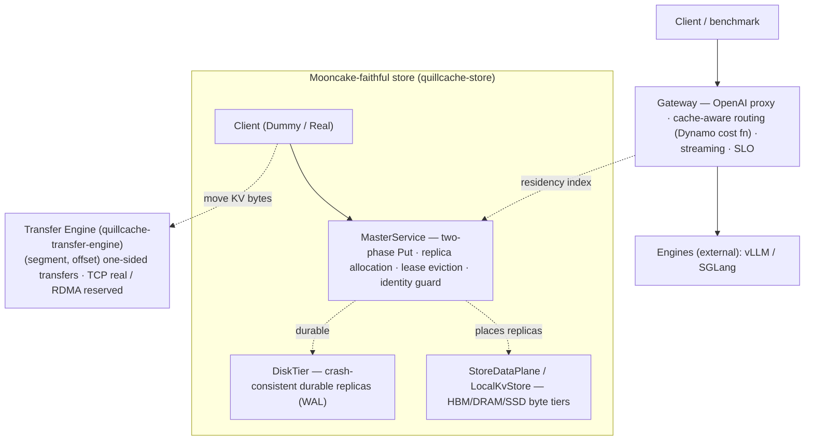

# QuillCache

[](https://github.com/feichai0017/quillcache/actions/workflows/ci.yml)
[](LICENSE)
[](https://feichai0017.github.io/quillcache/)
[](https://crates.io/crates/quillcache)

> **QuillCache is a faithful Rust port of [Mooncake](https://github.com/kvcache-ai/Mooncake)'s
> distributed KV cache store** (the KVCache-centric data plane from Moonshot / Kimi,
> FAST'25) — its component decomposition, code layout, and API mirrored module for
> module — **plus two properties the production data planes leave implicit:
> identity-governed safe reuse and a crash-consistent persistent tier.** A
> cache-aware routing gateway (the Dynamo KV-router cost function) sits in front.

QuillCache sits beside real inference engines (vLLM, SGLang) and owns the KV
cache as a resource. It does **not** run models — no transformer kernels, no
attention.

- a **Transfer Engine** (`quillcache-transfer-engine`) — moves bytes one-sidedly
  between *registered memory* by `(segment, offset)`, exactly like Mooncake (TCP
  today; RDMA / GPUDirect reserved behind the same trait);
- a **Store** (`quillcache-store`) — a two-phase-Put `Client`, a `MasterService`
  (object metadata, replica allocation, lease eviction), a buffer allocator, the
  replica model, and a crash-consistent durable `DiskTier`;
- a **Gateway / Conductor** — an OpenAI-compatible proxy that routes cache-aware
  (the Dynamo KV-router cost function), governs reuse, and meters SLO, backed by a
  persistent residency index.

## Architecture



## Reference-design mapping

QuillCache mirrors Mooncake's decomposition piece by piece, then adds its
differentiation on top:

| Mooncake / Dynamo | QuillCache | Status |
| --- | --- | --- |
| Transfer Engine (`TransferEngine` + `Transport`) | `quillcache-transfer-engine` (`engine` + `transport::{tcp,rdma,nvlink}`) | ✅ TCP / ⊙ RDMA · NVLink reserved |
| Store `Client` (`PutStart`/`PutEnd`/`Get`) | `DummyClient` / `RealClient` | ✅ end-to-end over the transfer engine |
| Store `MasterService` (two-phase Put, eviction) | `MasterService` | ✅ replica alloc · lease eviction |
| `BufferAllocator` + `AllocationStrategy` | `OffsetBufferAllocator` + `Random`/`FreeRatioFirst` | ✅ |
| `TransferMetadata` (etcd/redis/http/p2p) | `MetadataBackend`: `InMemoryMetadata` / `EtcdMetadata` (feature `etcd`) | ✅ in-memory / ⊙ etcd (real, needs a server) |
| Dynamo KV-router cost function | `DynamoCostRouter` | ✅ reproduces the worked example |
| Dynamo KVBM tiers (G1 HBM / G2 host / G3 disk) | `StoreDataPlane` (DRAM/SSD) + `quillcache-cuda` (HBM G1 + FP8 quantize) | ✅ DRAM/SSD · ⊙ HBM (GPU box) |
| Mooncake GPU data path (GPUDirect-RDMA · NVLink · GDS) | `rdma` / `nvlink` reserved transports | ⊙ needs a GPU / NIC |
| Dynamo KV-Cache Indexer | residency index (Holt ART) | ✅ persistent |
| — *(neither does this)* | **identity guard + crash-consistent `DiskTier`** | 🎯 differentiation |

## Crates

| crate | role |
| --- | --- |
| `quillcache` (bin) | the OpenAI-compatible **gateway** (proxy · cache-aware routing · streaming · SLO), the local **cluster** demo, and `bench-index` |
| `quillcache-core` | `KvBlockKey` / `IdentityScope` identity, `CostModel`, `ReuseViolation`; the `router` (incl. `DynamoCostRouter`), `control` plane, `DataPlane` + `IndexBackend` traits, the ART-vs-LSM `bench`, and the feature-gated `index_holt` / `index_rocksdb` backends |
| `quillcache-transfer-engine` | faithful port of Mooncake's Transfer Engine: `TransferEngine` + `MultiTransport` + `Transport` (`tcp` real / `rdma` reserved) + `TransferMetadata` + `Topology` |
| `quillcache-store` | faithful port of `mooncake-store`: `Client`, `MasterService`, `OffsetBufferAllocator`, `AllocationStrategy`, `Replica`, the crash-consistent `DiskTier`, plus `LocalKvStore` (byte pool) + `StoreDataPlane` (tiers) |
| `quillcache-cuda` | CUDA device tier: HBM↔host copies + FP8 quantize-on-offload (feature-gated, excluded from the default workspace) |

The two index backends (`index_holt`, `index_rocksdb`) are **feature-gated modules
inside `quillcache-core`**, off by default — `holt` is pure Rust; `rocksdb` pulls a
C++/libclang toolchain — so the default build needs neither.

## Status — wired online vs tested unit vs reserved

Everything here is real code — there is no simulation. The honest distinction is
how far each piece is integrated:

- **✅ wired online & measured** — the gateway, control plane, Dynamo-cost routing,
  persistent residency index, `StoreDataPlane` moving real bytes across
  HBM/DRAM/SSD, live SLO goodput, and the ART-vs-LSM storage study.
- **▣ tested unit (not yet on the live gateway path)** — the faithful store: a
  `Client` Put→Get over the transfer engine (real TCP), the `MasterService`
  two-phase Put + lease eviction, the identity guard, and `DiskTier` crash
  recovery. All covered by tests (and the `cluster` demo); wiring them into the
  live gateway needs an engine KV-connector for the engine⟷store byte handoff.
- **⊙ reserved / needs infra** — `RdmaTransport` / `NvlinkTransport` (behind
  `rdma` / `nvlink`), the `EtcdMetadata` backend (behind `etcd` — real etcd-client
  code + a background-watch-synced cache, compile-checked in CI, needs a running
  etcd to run), and the CUDA device tier (`quillcache-cuda --features cuda` on a
  GPU box). All real interfaces; the default build is hardware-free.

`cargo test` — 60 tests pass; `cargo fmt --check` and `cargo clippy` are clean.

## The storage study: ART (Holt) vs LSM (RocksDB)

The residency / prefix index is written on every KV event and read on every
request (longest reusable prefix); a persistent control plane needs it on disk.
Which storage engine fits a prefix-heavy, write-frequent index? Measured on the
same trace via `cargo run --features "rocksdb holt" -- bench-index`:

| backend | ingest | prefix_scan p50 | p99 | recovery | on-disk | write-amp |
| --- | --- | --- | --- | --- | --- | --- |
| memory (flat map) | 706k/s | 494 µs | 1685 µs | — | 0 | — |
| rocksdb (LSM) | 56k/s | 16.8 µs | 29.6 µs | 4.1 ms | small | **10.6×** |
| **holt (ART)** | 55k/s | **9.96 µs** | **13.7 µs** | **2.6 ms** | larger | **1.0×** |

ART gives the lowest prefix-scan latency (~1.7× faster than LSM at p50, ~50×
faster than the flat map's O(N) scan), the fastest recovery, and **1× write
amplification** (append-only — it writes each record once); LSM is far more
space-efficient on disk but pays **10.6× write amplification** (compaction
rewrites, measured from RocksDB's own statistics). Pick ART when prefix-scan
latency and recovery dominate (the common case for a residency index queried per
request), pick LSM when disk footprint is the constraint.

## Identity-governed safe reuse

A KV block's **content hash** is the same for the same tokens — regardless of
tenant, LoRA adapter, or model/tokenizer version — but the KV **tensors** depend
on all of those. So a cache that reuses on content hash alone (what
Mooncake / LMCache / KVBM key on) will serve blocks it must not: across
**tenants** → a privacy leak, across **adapters / models / tokenizers** → a
correctness error.

QuillCache makes the contract explicit: every block carries an `IdentityScope`
(model · tokenizer · adapter · tenant), and the guard is enforced at **every**
serving point — `LocalKvStore::get` and `DiskTier::get` (the byte tiers) and
`MasterService::get_replica_list` (the metadata layer, *before* any byte moves) —
refusing a cross-identity read with `ReuseViolation` rather than leaking. Mooncake
keys are identity-agnostic; this is QuillCache's addition, and it is the same
guard in memory, on disk, and after crash recovery.

## Crash-consistent durable tier

Mooncake's pool is volatile DRAM. QuillCache adds a durable `DiskTier` for `Disk`
replicas, so KV bytes survive a restart — backed by `LocalKvStore`'s SSD tier,
which uses NoKV-style **object-first atomic publish + a WAL**: write the block
file → `fsync` → append + `fsync` a commit record (the single publish point). On
`recover` the WAL is replayed and each surviving commit is verified against its
on-disk file (length + CRC) before it re-enters the index. The invariants, proven
by test:

- a **complete** block recovers and serves the correct bytes (identity-guarded,
  even after recovery);
- a **half-written / uncommitted** block (file with no commit record) is never served;
- a **corrupted** block (length / CRC mismatch) is dropped on recovery;
- a missing file never becomes a **dangling pointer** (no stale entries recovered).

This is the seam Mooncake's volatile-DRAM pool does not occupy: a durable,
crash-consistent, immediately-reusable persistent tier.

## Quick start

```bash
# Build and test the workspace (no GPU / RDMA / C++ toolchain needed).
cargo build
cargo test

# Local multi-node cluster demo on the Mooncake-faithful store: N storage-node
# transfer engines + a master + a client doing identity-guarded Put/Get over the
# transfer engine.
cargo run -- cluster --nodes 4 --requests 12

# The ART-vs-LSM storage study (needs a C++ toolchain for RocksDB).
cargo run --features "rocksdb holt" -- bench-index --backend holt
cargo run --features "rocksdb holt" -- bench-index --backend rocksdb

# Run the OpenAI-compatible gateway in front of real engines (optionally backed
# by a persistent ART/Holt residency index that survives restarts: index: holt).
cargo run -- gateway --config examples/quillcache-gateway.yaml
cargo run --features holt -- gateway --config examples/quillcache-gateway.yaml

# Build the CUDA device tier on a GPU box (excluded from the default workspace):
cd crates/quillcache-cuda && cargo build --features cuda
```

## Non-goals

- no transformer kernels, no model execution (QuillCache does not run models)
- no production multi-tenant isolation guarantee yet
- no vector database, no SQL frontend

## License

MIT — see [LICENSE](LICENSE).
