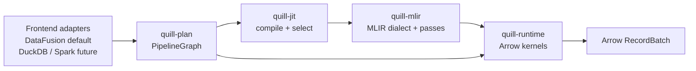

# QuillSQL

QuillSQL is a frontend-agnostic Arrow/MLIR query compiler and JIT execution
engine. DataFusion is the default frontend today; DuckDB, Spark, Substrait, or
other engines can be added through adapters that lower their plans into the same
`PipelineGraph`.

[](https://crates.io/crates/quill-sql)
[](LICENSE)
[](https://github.com/rust-unofficial/awesome-rust#database)
[](https://discord.gg/dJqa4RYW65)
[](https://deepwiki.com/feichai0017/QuillSQL)

<div align="center">
  
  <p><em>Frontend adapters, Arrow batches, and an MLIR JIT execution core.</em></p>
</div>

## Architecture



The stable boundary is `PipelineGraph`, not DataFusion. A frontend adapter owns
plan inspection and replacement. QuillSQL owns the neutral pipeline model, MLIR
lowering, Arrow runtime, and compiled execution path.

Operator semantics live in `quill-plan`; fusion policy lives in
`quill-jit`. `PipelineGraph` keeps semantic operators such as `filter`,
`project`, `plain_sum`, and `group_aggregate`; the `quill-jit` fusion registry
selects supported fragments, and MLIR lowering turns those fragments into fused
loops. That keeps frontend adapters thin and avoids query-specific fused
operators.

## Packages

| Package | Role |
| ------- | ---- |
| `quill-sql` | CLI, server, benchmarks, and release metadata. |
| `quill-core` | Public `Database` API and DataFusion-backed shell integration. |
| `quill-df` | Default DataFusion frontend adapter and `CompiledPipelineExec`. |
| `quill-plan` | Frontend-neutral `PipelineGraph`, expressions, types, operators, stages, and sinks. |
| `quill-jit` | Fusion registry, JIT orchestration, frontend adapter trait, dialect emission, and MLIR backend. |
| `quill-runtime` | Arrow binding, safety checks, fixed-width kernels, and result materialization. |
| `quill-mlir` | C++/TableGen MLIR dialect and lowering pass package. |

## Why `quill-mlir` Is Native

Rust builds pipeline graphs, integrates with DataFusion, and manages Arrow
batches. The formal MLIR dialect, TableGen operation definitions, verifiers, and
pass registration live in `quill-mlir` because those are native MLIR C++ API
surfaces. Rust calls into that package through `melior`.

Current compiled coverage is intentionally narrow: fixed-width
`filter -> project -> record_batch` and fixed-width `filter -> SUM`, including
the Q6-style `Date32`/`Decimal128` case. Unsupported expressions or unsafe
Arrow layouts stay on the safe Rust runtime or DataFusion path.

## Quick Start

```bash
cargo run --bin client

# keep DataFusion scratch state under a chosen directory
cargo run --bin client -- --data-dir .quillsql-data

# start web server at http://127.0.0.1:8080
cargo run --bin server
```

Sample session:

```sql
CREATE TABLE t AS SELECT 1 AS id, 10 AS v;
INSERT INTO t VALUES (2, 20), (3, 30);

SELECT id, v FROM t WHERE v > 10 ORDER BY id DESC LIMIT 1;
EXPLAIN SELECT id, COUNT(*) FROM t GROUP BY id ORDER BY id;
```

Parquet datasets can be registered through `Database::register_parquet`:

```rust
db.register_parquet("events", "/data/events.parquet").await?;
let out = db.run("SELECT count(*) FROM events WHERE user_id IS NOT NULL").await?;
```

## JIT And Benchmarks

```bash
# Requires LLVM/MLIR 22. Homebrew's llvm package works on macOS.
export MLIR_SYS_220_PREFIX=/opt/homebrew/opt/llvm
export LLVM_SYS_220_PREFIX=/opt/homebrew/opt/llvm

cargo test
cargo clippy --all-targets -- -D warnings
cargo bench --no-run

QUILL_JIT=mlir \
cargo bench --bench tpch -- q6_scan_filter_aggregate
```

Benchmark harnesses:

- `jit_micro`: lowering, compile, kernel, pipeline, and small SQL paths.
- `tpch`: Q6/Q1/Q3 analytical ladder over generated or external Parquet data.

Useful knobs:

- `QUILL_JIT=off`: pure DataFusion baseline.
- `QUILL_JIT=mlir`: executable MLIR kernels. This is the default mode.
- `QUILL_JIT=runtime`: Quill Arrow runtime without executable MLIR, kept for
  benchmark comparison.
- `QUILL_TPCH_SF=<scale>`: choose generated TPC-H scale factor. The default is
  SF1.
- `QUILL_TPCH_DIR=/path/to/tpch-parquet`: use an existing Parquet dataset.

## Scope

QuillSQL is no longer a teaching page-store database. It does not ship a custom
buffer pool, WAL, table heap, index manager, storage engine, SQL transaction
layer, or external KV adapter. The project is now focused on query compilation:
frontend plans in, Arrow batches out.

## Acknowledgements

- [Apache DataFusion](https://datafusion.apache.org/)
- [Apache Arrow](https://arrow.apache.org/)
- [MLIR](https://mlir.llvm.org/)
- [melior](https://github.com/mlir-rs/melior)

## Community

Discord: https://discord.gg/dJqa4RYW65
