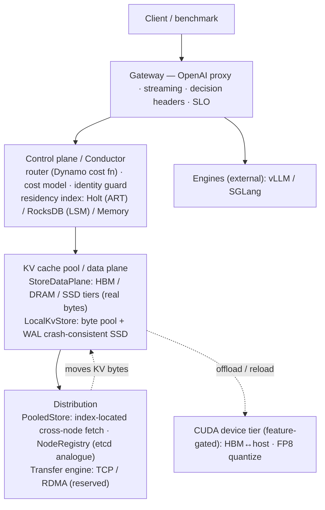

# QuillCache

[](https://github.com/feichai0017/quillcache/actions/workflows/ci.yml)
[](LICENSE)
[](https://feichai0017.github.io/quillcache/)
[](https://crates.io/crates/quillcache)

> **QuillCache is a Mooncake-style distributed KV cache pool and control plane for
> LLM serving, written in Rust** — replicating the architecture of NVIDIA Dynamo
> and Moonshot's Mooncake, plus two properties the production data planes leave
> implicit: **identity-governed safe reuse** and a **crash-consistent persistent
> tier**.

QuillCache sits beside real inference engines (vLLM, SGLang) and owns the KV
cache as a resource:

- a **byte pool** — DRAM + SSD tiers that hold real KV block bytes, with
  capacity-driven demotion and eviction;
- a **transfer engine** — moves blocks between nodes (TCP today, RDMA reserved);
- a **residency index** — maps each block (by identity) to where it lives
  (node + tier), persistent so it survives a restart;
- a **control plane / Conductor** — routes requests cache-aware (the Dynamo
  KV-router cost function), governs reuse, and meters SLO.

> It does **not** run models — no transformer kernels, no attention. The CUDA
> tier moves and quantizes KV *bytes* (the data path), not inference compute.

## Architecture



## Reference-design mapping

QuillCache replicates the production reference designs piece by piece, then adds
its differentiation on top:

| Mooncake / Dynamo | QuillCache | Status |
| --- | --- | --- |
| Mooncake Store (pooled DRAM/SSD KV) | `LocalKvStore` + `PooledStore` | ✅ real bytes |
| Mooncake Transfer Engine | `quillcache-transfer` | ✅ TCP / ⊙ RDMA reserved |
| Conductor / scheduler | `quillcache-control` + router | ✅ |
| Dynamo KV-router cost function | `DynamoCostRouter` | ✅ reproduces the worked example |
| Dynamo KVBM tiers (G1/G2/G3) | `StoreDataPlane` (HBM/DRAM/SSD) | ✅ moves real bytes |
| Dynamo KV-Cache Indexer | residency index (Holt ART) | ✅ persistent |
| Dynamo etcd / service discovery | `NodeRegistry` (`StaticRegistry`) | ✅ etcd pluggable |
| — *(neither does this)* | **identity guard + crash-consistency** | 🎯 differentiation |

## Crates

| crate | role |
| --- | --- |
| `quillcache-gateway` | OpenAI-compatible gateway: proxy, streaming, decision headers, SLO goodput |
| `quillcache-control` | control plane: `plan()` / `observe_placement` / `audit_reuse` |
| `quillcache-router` | routing policies incl. `DynamoCostRouter` (+ greedy / SLO-aware / session / prefix-affinity / round-robin) |
| `quillcache-core` | `KvBlockKey` identity, `CostModel`, the `IndexBackend` + `DataPlane` traits, and the ART-vs-LSM `bench` |
| `quillcache-store` | `LocalKvStore` (crash-consistent byte pool), `StoreDataPlane` (tiers), `PooledStore`, `NodeRegistry` |
| `quillcache-transfer` | transfer engine: `LocalTransfer` / `TcpTransfer` / `RdmaTransfer` (reserved) |
| `quillcache-index-holt` | Holt (persistent ART) index backend |
| `quillcache-index-rocksdb` | RocksDB (LSM) index backend |
| `quillcache-cuda` | CUDA device tier: HBM↔host copies + FP8 quantize-on-offload (feature-gated, excluded from the workspace) |

## Status — wired online vs tested unit vs reserved

Everything here is real code — there is no simulation (the earlier cost-model
sims were removed). The honest distinction is how far each piece is integrated:

- **✅ wired online & measured** — gateway, control plane, Dynamo-cost routing,
  persistent residency index, `StoreDataPlane` moving real bytes across
  HBM/DRAM/SSD, the identity guard, live SLO goodput, and the ART-vs-LSM storage
  study.
- **▣ tested unit (not yet on the online gateway path)** — `PooledStore`
  cross-node fetch over TCP, and `LocalKvStore::recover` crash recovery. Both are
  covered by tests; wiring them into the live gateway needs an engine
  KV-connector for the engine⟷pool byte handoff.
- **⊙ reserved / needs hardware** — `RdmaTransfer` (behind the `rdma` feature) and
  the CUDA device tier (build `quillcache-cuda` with `--features cuda` on a GPU
  box). Both are real interfaces, stubbed/fallback so the default build is
  hardware-free.

`cargo test` — 45 tests pass; `cargo fmt --check` and `cargo clippy` are clean.

## The storage study: ART (Holt) vs LSM (RocksDB)

The residency / prefix index is written on every KV event and read on every
request (longest reusable prefix); a persistent control plane needs it on disk.
Which storage engine fits a prefix-heavy, write-frequent index? Measured on the
same trace via `cargo run --features "rocksdb holt" -- bench-index`:

| backend | ingest | prefix_scan p50 | p99 | recovery | on-disk | write-amp |
| --- | --- | --- | --- | --- | --- | --- |
| memory (flat map) | 706k/s | 494 µs | 1685 µs | — | 0 | — |
| rocksdb (LSM) | 56k/s | 16.8 µs | 29.6 µs | 4.1 ms | small | **10.6×** |
| **holt (ART)** | 55k/s | **9.96 µs** | **13.7 µs** | **2.6 ms** | larger | **1.0×** |

ART gives the lowest prefix-scan latency (~1.7× faster than LSM at p50, ~50×
faster than the flat map's O(N) scan), the fastest recovery, and **1× write
amplification** (append-only — it writes each record once); LSM is far more
space-efficient on disk but pays **10.6× write amplification** (compaction
rewrites). Write amplification is measured from RocksDB's own flush/compaction
statistics, not assumed. Pick ART when prefix-scan latency and recovery dominate
(the common case for a residency index queried per request), pick LSM when disk
footprint is the constraint.

## Identity-governed safe reuse

A KV block's **content hash** is the same for the same tokens — regardless of
tenant, LoRA adapter, or model/tokenizer version — but the KV **tensors** depend
on all of those. So a cache that reuses on content hash alone (what
Mooncake / LMCache / KVBM key on) will serve blocks it must not: across
**tenants** → a privacy leak, across **adapters / models / tokenizers** → a
correctness error.

QuillCache makes the contract explicit: every block carries an `IdentityScope`
(model · tokenizer · adapter · tenant), and `LocalKvStore::get` serves a block
only when the requester's identity matches, returning `StoreError::Unsafe`
otherwise. On a collision-heavy workload, naive content-hash reuse serves
**96.8% unsafe** while the guard serves **0**; on a realistic mostly-same-identity
mix the guard's overhead is **~1.7%**. Safety is near-free exactly where it
matters.

## Crash-consistent SSD tier

The SSD tier holds real KV bytes that should survive a restart, so it needs a
durable, crash-consistent catalog. It uses NoKV-style **object-first atomic
publish + a WAL**: write the block file → `fsync` → append + `fsync` a commit
record (the single publish point). On `LocalKvStore::recover` the WAL is replayed
and each surviving commit is verified against its on-disk file (length + CRC)
before it re-enters the index. The invariants, proven by test:

- a **complete** block recovers and serves the correct bytes (identity-guarded);
- a **half-written / uncommitted** block (file with no commit record) is never served;
- a **corrupted** block (length / CRC mismatch) is dropped on recovery;
- a missing file never becomes a **dangling pointer** (the recovered index has no stale entries).

This is the seam Mooncake's volatile-DRAM pool does not occupy: a durable,
crash-consistent, immediately-reusable persistent tier.

## Quick start

```bash
# Build and test the workspace (no GPU / RDMA / C++ toolchain needed).
cargo build
cargo test

# The ART-vs-LSM storage study (needs a C++ toolchain for RocksDB).
cargo run --features "rocksdb holt" -- bench-index --backend holt
cargo run --features "rocksdb holt" -- bench-index --backend rocksdb

# Run the OpenAI-compatible gateway in front of real engines.
cargo run -- gateway --config examples/quillcache-gateway.yaml
# ...backed by a persistent ART (Holt) residency index that survives restarts:
cargo run --features holt -- gateway --config examples/quillcache-gateway.yaml  # set index: holt

# Build the CUDA device tier on a GPU box (excluded from the default workspace):
cd crates/quillcache-cuda && cargo build --features cuda
```

## Non-goals

- no transformer kernels, no model execution (QuillCache does not run models)
- no production multi-tenant isolation guarantee yet
- no vector database, no SQL frontend

## License

MIT — see [LICENSE](LICENSE).
