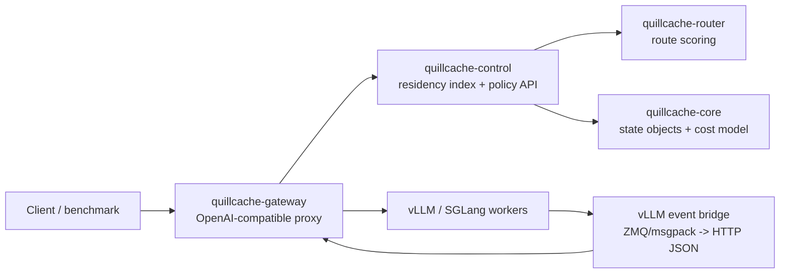

# QuillCache Architecture

QuillCache is scoped as a control plane for inference state, not as a model
runtime. The first boundary is a KV block object model that is independent from
any single engine implementation.

## Runtime Topology



## State Objects

The core state object is `KvBlockKey`:

- `model_id`
- `tokenizer_id`
- `adapter_id`
- `tenant_id`
- `prefix_hash`
- `block_hash`
- `block_index`
- `token_count`

The identity is intentionally stricter than `block_hash` alone. KV cache reuse is
only valid when the model, tokenizer, adapter, and tenant policy agree.

## Routing Loop

For each request, the gateway builds a `RequestShape` from request metadata and
optional `quillcache` block hints. The router evaluates candidate workers and
block-level choices:

1. use a local HBM hit
2. transfer a block from another worker or tier
3. recompute the block with prefill

The first router is greedy and cost-model based. It is not the final research
claim; it exists to make baselines and traces executable.

## Residency Index Boundary

`quillcache-control` owns the index boundary through `ResidencyIndexStore`.
The gateway and router depend on that trait, not on a concrete storage engine.

The v0.1 backend is `MemoryResidencyIndex`, which keeps:

```text
KvBlockKey -> Vec<CacheResidency>
```

The planned persistent backend is Holt. Holt should store prefix/residency
metadata and recovery state. It should not become the component that moves KV
tensors between GPU, DRAM, SSD, or remote memory. That responsibility belongs to
the inference engine and data-plane connectors.

This split leaves room for ART-vs-LSM research: Holt can implement the same
trait as a RocksDB baseline while the gateway, event ingest, and router stay
unchanged.

## MVP Gateway

The gateway currently exposes:

- `POST /v1/chat/completions`
- `POST /v1/completions`
- `POST /v1/kv-events`
- `GET /v1/state`
- `GET /healthz`

The proxy endpoints are OpenAI-compatible and forward requests to the selected
engine. The gateway strips the optional `quillcache` request object before
forwarding. This lets benchmarks provide exact block hashes while keeping the
upstream vLLM/SGLang request clean.

`GET /v1/state` returns configured engines, worker state, index stats, and the
current residency snapshot. This endpoint is intentionally simple because v0.1
is a research prototype, not an operator UI.

The event ingest endpoint accepts a vendor-neutral JSON shape compatible with
vLLM's KV event concepts: block stored, block removed, and all blocks cleared.
The included Python bridge subscribes to vLLM's ZMQ/msgpack event stream and
posts those events into this endpoint.

## Future Connector Boundary

The connector layer should be thin:

- observe KV block creation and eviction events from an engine
- inject reusable blocks back into the engine KV manager
- expose transfer metadata for disaggregated prefill/decode
- keep engine-specific layout details outside the router

Initial integration targets should be vLLM or SGLang via existing connector
paths rather than a custom inference engine.
