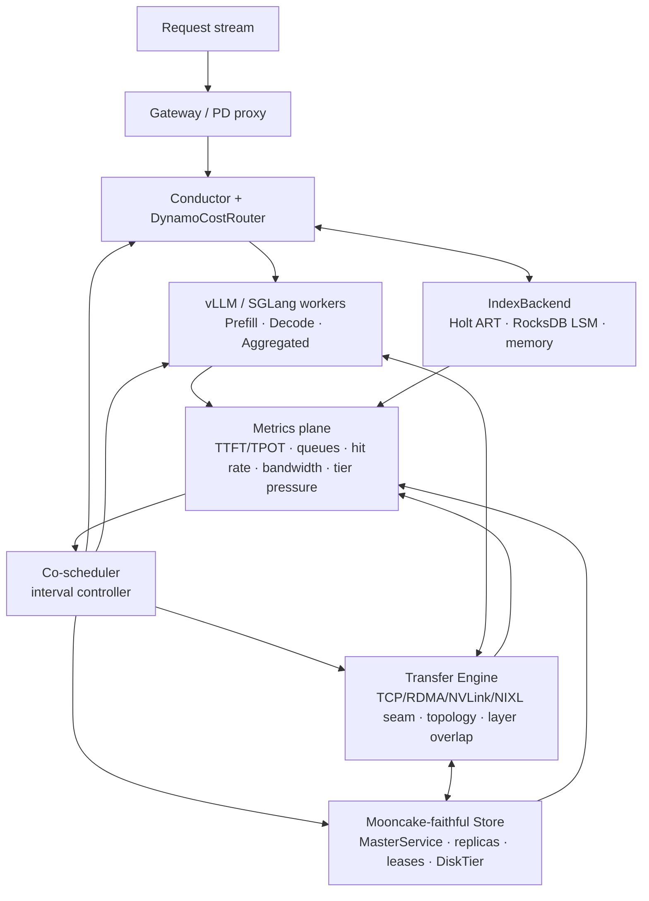

# KV-cache-centric Co-scheduler

This document is the next design line for QuillCache. The system already has a
Mooncake-faithful KV store, a Transfer Engine, vLLM/SGLang connector seams,
Dynamo-style routing, identity-safe reuse, and durable tiers. The missing layer
is a cluster-level controller that treats KV cache, compute, memory, and network
as one coupled resource.

## Problem

Disaggregated LLM serving is not limited by one resource. The bottleneck shifts
between:

- prefill compute, which determines TTFT;
- decode compute and batch occupancy, which determine TPOT and throughput;
- HBM capacity, which decides whether useful KV stays local;
- DRAM/SSD/CXL/NVMe capacity, which decides whether reuse is cheaper than
  recompute;
- interconnect bandwidth and topology, which decide whether remote KV fetch is
  worth it;
- adapter overhead, which decides whether transfer can overlap with model
  compute.

Static routing is too local. It can pick the best worker for one request, but it
cannot rebalance P/D capacity, HBM cache split, replication, admission, transfer
depth, and tier placement as workload phase changes.

The co-scheduler is the per-interval control loop above the per-request router.
Its objective is:

```text
maximize SLO goodput per GPU
subject to TTFT/TPOT SLO, HBM capacity, transfer bandwidth, and identity safety
```

## System Boundary

QuillCache owns:

- KV object metadata and identity (`IdentityScope`, `KvBlockKey`);
- residency and prefix overlap (`IndexBackend`, Conductor `PrefixCacheTable`);
- store metadata and placement (`MasterService`, replicas, leases, pins);
- byte movement APIs (`TransferEngine`, TCP/RDMA/NVLink/NIXL seam);
- routing and policy decisions (`DynamoCostRouter`, action sink, metrics);
- local controller decisions in the gateway/control plane.

QuillCache does not own:

- model execution kernels;
- vLLM/SGLang block manager internals;
- NIXL/UCX implementation details;
- cluster resource manager ownership such as Kubernetes scheduling.

The engine remains authoritative for live paged-KV layout inside its own HBM.
The store/master remains authoritative for external KV replicas. The
co-scheduler only acts through explicit, idempotent control actions.

## Architecture



The router answers "where should this request go?" The co-scheduler answers
"how should the cluster shape itself for the next interval?"

## Observations

The controller samples a `ClusterSnapshot` every interval:

| Signal | Source | Why it matters |
| --- | --- | --- |
| TTFT p50/p99, TPOT p50/p99, SLO miss | gateway metrics | primary objective |
| prefill queue depth, decode running count | worker state / connector | P/D ratio pressure |
| local HBM hit rate, remote hit rate, recompute count | router traces | cache value vs compute |
| HBM/DRAM/SSD bytes and evictions | `DataPlane` / store | tier pressure |
| transfer queue depth, time-to-first-layer, bandwidth | Transfer Engine | overlap and network pressure |
| topology affinity, selected NICs, GDR viability | `Topology` | GDR vs CPU-staged decision |
| hot prefix counters | `CountMinSketch` | replication/pinning candidates |
| unsafe reuse refusals | identity guard | correctness/security signal |

## Actions

The co-scheduler emits bounded, idempotent actions:

| Action | Target | Effect |
| --- | --- | --- |
| `AdjustPdRatio` | gateway / worker pool | shift capacity between prefill and decode roles |
| `AdjustHbmSplit` | engine adapter / data plane | reserve more HBM for active decode or reusable KV |
| `ReplicateHotPrefix` | store + transfer engine | copy hot prefix to another worker/tier |
| `PromotePrefix` / `DemotePrefix` | store/data plane | move KV across HBM/DRAM/SSD/CXL tiers |
| `TuneTransferDepth` | transfer engine | change per-request/layer in-flight depth |
| `SelectTransferBackend` | transfer engine | choose NIXL/RDMA/TCP/CPU-staged by topology and load |
| `AdmissionReject` | gateway | reject or shed requests predicted to violate SLO |
| `PinPrefix` / `UnpinPrefix` | master service | protect hot prefixes from eviction |

Actions carry an epoch and are safe to retry. A stale action is ignored if its
epoch is older than the last accepted plan.

## Control Policy

The initial policy should be deliberately simple and measurable.

1. **Protect SLO first.** If TTFT p99 or TPOT p99 exceeds budget, reduce work
   admitted into the overloaded phase before optimizing cache hit rate.
2. **Prefer reuse only when it beats recompute.** Remote fetch is useful when
   `transfer_cost + queue_cost < prefill_cost`. Otherwise recompute.
3. **Replicate hot prefixes only when bandwidth and HBM headroom exist.** A hot
   prefix that causes repeated cross-node transfers is a replication candidate.
4. **Use layer-wise overlap before faster wire assumptions.** Hide transfer
   behind compute with `run_layers_with_notify`; NIXL/RDMA then lowers the
   remaining per-layer cost.
5. **Gate GPUDirect by topology.** If `prefers_gpudirect(location, SameNuma)` is
   false, use CPU-staged RDMA/TCP until real measurements say otherwise.
6. **Use early rejection under overload.** When the predicted request cannot meet
   SLO even with best reuse, reject early instead of consuming GPU time that
   becomes badput.

## Invariants

- Identity safety is non-negotiable: no action can bypass
  `model/tokenizer/adapter/tenant` checks.
- The master is the source of truth for external KV replicas. Workers can cache
  derived state, but commits and readable replicas are master-owned.
- A prefix cannot be evicted or demoted while a live transfer/read lease protects
  it.
- A `PutStart` object is not readable until `PutEnd`.
- Layer-wise transfer must notify consumers in layer order, even if transfers
  complete out of order.
- Transfer backend selection must be a performance decision, not a correctness
  decision; TCP remains the fallback.
- The controller can be disabled without breaking the serving path. Static
  routing remains the baseline.

## Interfaces To Existing Code

| Existing module | Co-scheduler role |
| --- | --- |
| `quillcache-core::router` | per-request route/cost baseline |
| `quillcache-core::conductor` | prefix overlap and KV-event state |
| `quillcache-core::replication` | hot-prefix replication primitive |
| `quillcache-store::MasterService` | replica placement, leases, pins, eviction |
| `quillcache-transfer-engine::slice_pool` | layer-wise transfer scheduling |
| `quillcache-transfer-engine::Topology` | NIC/GPU affinity and GDR gating |
| `bridge/quillcache_v1_connector.py` | vLLM layer save/load integration |
| `src/gateway.rs` / `src/pd_proxy.rs` | request path and action actuation |

## Implementation Plan

### P0: Design-stable metrics and actions

- Add `CoSchedulerSnapshot`, `CoSchedulerTelemetry`, `CoSchedulerAction`, and
  `CoSchedulerPlan` data types.
- Build `ControlPlane::co_scheduler_snapshot(...)` from live workers,
  residency/data-plane metrics, and hot-prefix counters.
- Expose a `/v1/state.co_scheduler` dry-run plan in the gateway. P0 emits
  suggestions only; it does not mutate routing, placement, or worker roles.
- Export gateway metrics for planner-estimated full KV fetch time and first
  fetch time; feed those into `TransferObservation` until the Transfer Engine
  reports measured per-transfer completion times.
- Remaining telemetry: measured time-to-first-layer, full-transfer time,
  overlap saved ms, and predicted-vs-actual TTFT once layer-aware transfer
  execution is connected.
- Add a dry-run controller that logs actions without applying them.

Acceptance: static serving behavior is unchanged; `/v1/state` exposes the
co-scheduler snapshot and dry-run plan; unit tests cover the first action
selection rules. Stale-epoch rejection belongs to the actuator in P2.

### P1: Layer-aware store object model

- Add `LayerManifest`: layer count, per-layer offset/len, dtype/layout,
  checksum/version, and identity.
- Add layer-aware `put_layer` / `get_layer` or a batched `get_layers` API on top
  of the existing two-phase Put/Get.
- Connect `run_layers_with_notify` to store reads so a consumer can start after
  layer 0.

Acceptance: a KV object can be stored and loaded per layer over the current TCP
transfer engine; layer-order notification is preserved; monolithic Get remains a
compatibility path.

### P2: Closed-loop planner

- Implement interval controller with static thresholds:
  - high prefill queue -> more prefill capacity or admission reject;
  - decode TPOT pressure -> protect decode workers from remote fetch stalls;
  - high remote fetch count for a hot prefix -> replicate/pin;
  - high transfer wait -> lower in-flight depth or switch backend;
  - HBM pressure -> demote cold prefixes.
- Apply actions through existing gateway/store/transfer seams.

Acceptance: local bursty workload shows higher SLO goodput than static routing
while preserving identity and recovery invariants.

### P3: Hardware path

- Add NIXL/UCX backend through FFI or sidecar.
- Measure GDR vs CPU-staged transfer under topology-affinity cases.
- Add multi-NIC striping and backend selection policy.

Acceptance: report bandwidth, SM utilization, TTFT p99, and overlap ratio on a
real NIC/GPU setup. CI still runs TCP-only.

## Evaluation Matrix

| Dimension | Values |
| --- | --- |
| Workload | bursty chat, long-context RAG, repeated-prefix agent, P/D mixed |
| Policy | static routing, cache-aware only, co-scheduler dry-run, co-scheduler applied |
| Transfer | monolithic blob, layer-wise TCP, layer-wise RDMA/NIXL |
| Tier | HBM-only, HBM+DRAM, HBM+DRAM+SSD, CXL/NVMe future |
| Topology | local GPU, same-switch NIC, same-NUMA NIC, cross-NUMA NIC |

Primary metrics:

- SLO goodput;
- TTFT p50/p99 and TPOT p50/p99;
- GPU utilization and decode batch occupancy;
- time-to-first-layer and overlap saved ms;
- recompute rate, local hit rate, remote hit rate;
- bandwidth and transfer queueing;
- eviction/demotion/promotion count;
- unsafe reuse refusals.

## Claim Budget

Guaranteed properties:

- identity-safe reuse is preserved across memory, disk, and master metadata;
- layer notifications are in order;
- stale controller actions are rejected by epoch;
- static routing remains available if the controller is disabled.

Measured effects:

- layer-wise transfer reduces consumer-start latency versus monolithic transfer;
- co-scheduling improves SLO goodput versus static routing under bursty load;
- topology-aware backend choice avoids bad GPUDirect cases.

Design hypotheses:

- P/D ratio, HBM cache split, hot-prefix replication, and transfer depth should
  be controlled by one interval planner because they compete for the same SLO
  budget;
- NIXL/UCX should be adopted as the GPU wire while QuillCache contributes the
  scheduling and identity/storage semantics above it.

Non-goals:

- replacing vLLM/SGLang schedulers;
- implementing transformer kernels;
- hand-rolling IBGDA;
- claiming production multi-tenant isolation beyond the identity guard.

## Interview Framing

For AML / AI Infra, the concise framing is:

> QuillCache treats KV cache as a first-class distributed storage resource for
> inference. It combines a Mooncake-style KV store, high-performance transfer
> engine, vLLM/SGLang connector, and a co-scheduler that balances prefill/decode
> compute, HBM/DRAM/SSD capacity, and network transfer to maximize SLO goodput.

The technical depth is in the tradeoffs:

- remote fetch versus recompute;
- HBM cache versus active decode working set;
- GPUDirect versus CPU-staged transfer by topology;
- prefill/decode capacity split;
- early rejection versus badput;
- layer-wise overlap versus monolithic transfer.
