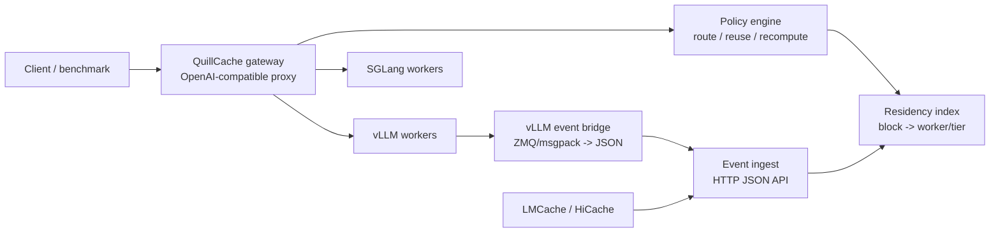

# QuillCache Platform Plan

## Positioning

QuillCache is a research and engineering platform for KV-cache-aware LLM
serving. It sits in front of existing inference engines and turns their KV cache
state into an observable, routable, and experimentally comparable control-plane
resource.

QuillCache does not implement transformer kernels or model execution. The first
integration targets are vLLM, SGLang, LMCache, HiCache, and future NIXL or
Mooncake-style transfer paths.

## Platform Goals

1. Route OpenAI-compatible requests using KV residency, load, and SLO signals.
2. Ingest KV cache lifecycle events from real inference engines.
3. Maintain a global residency index across workers and storage tiers.
4. Provide a policy API for reuse, transfer, recompute, prefetch, pin, evict,
   and compression decisions.
5. Run trace-based experiments against comparable baselines.
6. Explain every routing decision with cache hit, transfer, recompute, and SLO
   estimates.
7. Compare persistent residency-index backends, starting with Holt ART versus a
   RocksDB/LSM baseline.

## Non-Goals

- no custom attention kernels
- no replacement for vLLM or SGLang
- no tensor transfer implementation in the first MVP
- no production-grade multi-tenant isolation guarantee yet
- no Kubernetes operator in the first MVP

## Architecture

## MVP Scope

The first complete MVP is an event-driven gateway:

- `quillcache gateway --config examples/quillcache-gateway.yaml`
- `/v1/chat/completions` and `/v1/completions` proxy endpoints
- `/v1/kv-events` HTTP ingest endpoint
- `/v1/state` debug endpoint
- vLLM ZMQ KV event bridge script
- cache-aware route decisions using the existing greedy router
- request-local `quillcache` hints for exact block-hash experiments
- pluggable residency-index interface with a memory backend

The MVP routes real HTTP requests to real vLLM or SGLang servers. It also ingests
real vLLM KV events through the bridge when vLLM is started with KV event
publishing enabled.

## v0.1 Acceptance Criteria

1. Run two vLLM servers with different ports.
2. Run the QuillCache gateway in front of them.
3. POST KV events into `/v1/kv-events`, either from the bridge or a synthetic
   event.
4. Send an OpenAI-compatible completion request through QuillCache.
5. Observe `x-quillcache-*` headers showing selected engine, local hits, transfer
   blocks, recompute blocks, and estimated TTFT.
6. Query `/v1/state` and see resident KV blocks indexed by engine.
7. Confirm `/v1/state.index` reports the active index backend and resident block
   count.

## Build Order

1. MVP gateway and HTTP event ingest.
2. vLLM event bridge and request hint format.
3. Trace benchmark runner for repeated-prefix and RAG workloads.
4. Holt-backed persistent residency index.
5. RocksDB/LSM baseline for index measurement.
6. Native vLLM block-hash extraction or tokenizer-sidecar support.
7. SGLang/HiCache event adapter.
8. Policy plugin interface and baseline suite.
9. Kubernetes deployment path with Gateway API or Envoy.
10. Real transfer integration through LMCache, vLLM `kv_transfer`, or NIXL.

## Research Claims

The platform should support claims such as:

- A router with global KV residency visibility reduces TTFT and P99 TTFT for
  repeated-prefix, RAG, and agent-session workloads.
- SLO-aware routing avoids cache-locality overload by balancing reuse against
  queue pressure.
- Session-aware pinning and eviction reduce recomputation in agent workflows
  with long tool-call gaps.
- A prefix-native ART residency index can reduce write amplification or recovery
  cost compared with an LSM baseline for KV-cache metadata workloads.
- A unified policy plane can compare LMCache-like, Mooncake-like,
  Dynamo-like, and QuillCache-specific policies on the same traces.
